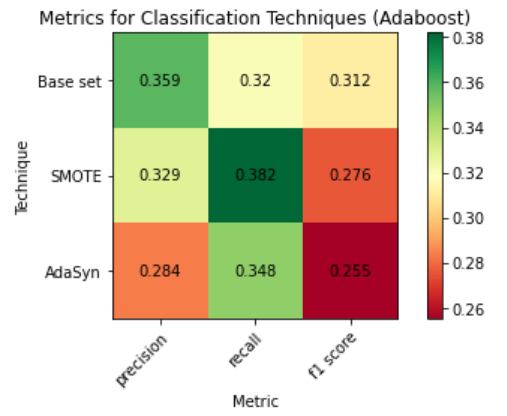
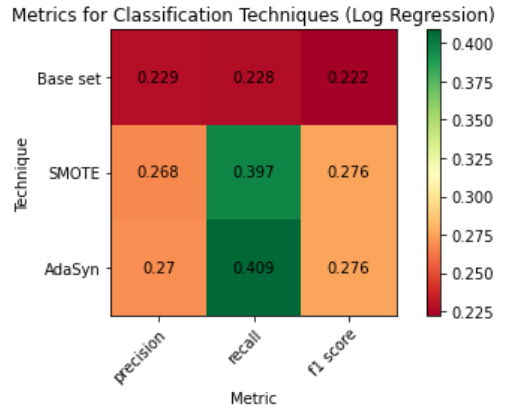

# There Can Only Be One Winner: Testing Class Imbalance Techniques on NCAA March Madness Data

## Introduction

Every year, the winner of the NCAA College Basketball season is decided in a 68 team tournament. From this large pool, in three weeks of basketball, one winner is decided. There is good money to be made in being able to predict this winner; billions of dollars are gambled every year on the tournament, justifiably named “March Madness”. However, given how few of the initial teams end up successful, modeling this data can be difficult, as it presents a classic class imbalance problem.

Class imbalance problems occur when the number of observations within each target class is significantly different. Many classifiers have issues with this type of problem for a very simple reason: overall accuracy and precision can be maximized by simply assuming all entries are in the majority class. However, in some class imbalance cases, such as cancer or landmine detection, this assumption can render models dangerously useless. 

The class imbalance in March Madness bracket prediction comes about naturally in the way brackets work: in each round, half of the teams are eliminated. Thus, while 32 teams will lose in the first round, there is only one champion (and one championship loser). If we take each of these stages of placement in the tournament to be a class, we will end up with 32 times more teams in the “zero games won” class than the “champion” class. Once again, a model not suited for this kind of problem would likely over-predict the number of teams which do not win a game.

There are a variety of methods that can be used to confront this issue. The two of which we will be using are AdaSyn (Adaptive Synthetic Sampling) and SMOTE (Synthetic Minority Oversampling), each of which add synthetic samples from the undersampled classes to the data set to eliminate the imbalance. Additionally, we will use two classification methodologies: a simple logistic regression method and an Adaboost classifier. Adaboost is an ensemble method which gathers the targets from weak classifiers before boosting the results based on residuals—in this case, that distance is simply the separation from the correct classification. However, since these misclassifications are weighted more in the next iteration, Adaboost can naturally deal with class imbalances by compensating with higher weights for class minorities.

A previous study which introduced AdaSyn (He et al. 2008) suggested that further studies be undertaken evaluating class imbalance techniques for multi-class data and boosted algorithms. This project aims to explore these areas.

I have collected a dataset of 6 years of March Madness placements, along with the team statistics throughout those seasons. In this project, I will use this data to determine which  technique described above is best at predicting successful March Madness data, measured by recall, accuracy, and F-score. 

## Data

The website [sports-reference.com](https://www.sports-reference.com/) provides team and player statistics from a variety of sports, both at the professional and college level. My data was collected manually from the college basketball section of the site. For each year from 2014 to 2019 I collected team statistics from each team which qualified for the NCAA tournament. These statistics include winning percentage, strength of schedule, points per game, total rebounding percentage, and more; in total, there are 23 features. However, as some of these variables are heavily collinear or derivative of one another, I will be only using 5 of them, shown in the accompanying table below. Note that this data only comes from games played in the regular season before each tournament. 

| Variable Name  | Statistic Measured | Calculation |
| ------------- | ------------- | ------------- |
| Win.per  | Winning Percentage  | # Wins /# Games Played  |
| SOS  | Strength of Schedule  | [Average opponent rating, based on linear solution of games' winning margins](https://www.sports-reference.com/blog/2015/03/srs-calculation-details/)  |
| STL.per  | Steal Percentage  | Steals /# Opponents Possessions  |
| ORtg  | Offensive Rating  | Points /100 Possessions  |
| ORB.per  | Offensive Rebounding Rate  | Off. Rebounds / Chance  | 

I then manually input the target data—quantified as the number of games won in the tournament—by comparing the tournament results in those years. The resulting dataset contains *N = 386* teams. Of these the number in classes *y = 5* and *y = 6* games won are each 6, compared to 194 in class *y = 0*. Clearly, this motivates the use of class imbalance techniques.
 
## Methods

### SMOTE

The first of the three unique methods I will cover for this project is SMOTE, or Synthetic Minority Oversampling. SMOTE, like AdaSyn, produces new samples from the minority classes until each has a balanced number of samples. It does this by generating new samples along the euclidean paths between the minority class observations.

However, we first must determine how many, and where, these new synthetic samples should go. To add a sample, a random minority class observation is selected. The k nearest neighbors to this observation are identified, and a synthetic sample is added at a random point on the line segment connecting these two samples. The typical value of k selected is 5; in this project we will use this value, as any increase would be impossible to account for given that there are only 6 observations in the smallest minority class (there cannot be more than 5 neighbors in the entire feature space). For each minority class, samples are added in this way until they are as prevalent as the majority class.

### AdaSyn

AdaSyn, or Adaptive Synthetic Sampling, is based off of SMOTE. Like its predecessor, AdaSyn generates random samples on lines between existing minority class samples. In an effort to boost observations which are difficult to learn due to being surrounded by majority samples, AdaSyn first calculates a weight of the number of majority class samples within the 5 nearest neighbors to each minority class sample. The synthetic samples are biased to be created in lines between samples which are closer to more majority class samples. This is done in an effort to raise the “awareness” of these neighborhoods so they can more easily be learned by the eventual classifier.

### Adaboost

Lastly, I will cover the Adaboost classifier. As stated in the introduction, while this is not explicitly designed to fix class imbalances, it can do so in certain situations. Adaboost is an ensemble learning method which uses residuals to improve with each iterated learner; this use of model residuals is known as boosting.

The first step in Adaboost is to set the weight *w* of each data point to *1/N*, where *N* is our number of observations. Next, a sample of these observations is taken, and a decision stump (decision tree with depth of 1) is made from this sample for each variable. Next, the whole data set is tested on these decision stumps. Then, each sample’s weight is recalculated based on the following formulas:


Where &alpha; is calculated by:


Where *Total Error* is calculated as the fraction of outputs which are correctly classified.

The sign of &alpha; in the *w<sub>new</sub>* equation is determined by whether the observation itself was correctly classified. Thus, each misclassified observation has a higher weight and each correctly classified observation has a lower weight. The magnitude of this change is proportional to the overall accuracy of the stump. The weights are renormalized such that &Sigma; x<sub>i</sub> = 1, and another set of stumps is trained. However, the subset of data used for this set is determined by the weights: more heavily weighted data points are more likely to be selected. In this way, heavily weighted points are likely to end up in more stumps, and more likely to influence the final prediction (based on the most votes by all trees). 

We can now see why this method serves as a solution to class imbalances: minority classes which are routinely misclassified will become more and more common in decision trees until they are as prevalent in the decisive model as majority classes.

## Application

First, we will import the libraries we are going to need for this analysis.

```Python
import numpy as np
import pandas as pd
from imblearn.over_sampling import SMOTE
from imblearn.over_sampling import ADASYN 
from collections import Counter
import matplotlib.pyplot as plt
from sklearn.linear_model import LogisticRegression
from sklearn.ensemble import AdaBoostClassifier
from sklearn.utils import resample
from sklearn.datasets import make_classification
from sklearn.metrics import classification_report as CR
```

Next we will load our data into the notebook.

```Python
df = pd.read_csv('/content/drive/MyDrive/Colab Notebooks/For_Python.csv')

Xraw = df[['Win.per','SOS', 'STL.per', 'ORtg', 'ORB.per']].values
yraw = df['GamesWon']
```

Now we can define our models:

```Python
modelLR = LogisticRegression(solver='lbfgs',max_iter=10000)
modelAC = AdaBoostClassifier()
```

Here we are calculating the precision, recall, and F<sub>1</sub> score for each data set augmentation, and fit them to the logistic regression model.

```Python
metricsLR = []

modelLR.fit(Xraw,yraw)
metricsLR.append(CR(yraw,modelLR.predict(Xraw), output_dict=True)['macro avg']['precision'])
metricsLR.append(CR(yraw,modelLR.predict(Xraw), output_dict=True)['macro avg']['recall'])
metricsLR.append(CR(yraw,modelLR.predict(Xraw), output_dict=True)['macro avg']['f1-score'])

smote = SMOTE(random_state=22)
xs, ys = smote.fit_resample(Xraw, yraw)
modelLR.fit(xs,ys)
metricsLR.append(CR(yraw,modelLR.predict(Xraw), output_dict=True)['macro avg']['precision'])
metricsLR.append(CR(yraw,modelLR.predict(Xraw), output_dict=True)['macro avg']['recall'])
metricsLR.append(CR(yraw,modelLR.predict(Xraw), output_dict=True)['macro avg']['f1-score'])

ada = ADASYN(random_state=22)
xa, ya = ada.fit_resample(Xraw, yraw)
modelLR.fit(xa,ya)
metricsLR.append(CR(yraw,modelLR.predict(Xraw), output_dict=True)['macro avg']['precision'])
metricsLR.append(CR(yraw,modelLR.predict(Xraw), output_dict=True)['macro avg']['recall'])
metricsLR.append(CR(yraw,modelLR.predict(Xraw), output_dict=True)['macro avg']['f1-score'])


metricsLR = np.asarray(metricsLR).reshape(3,3)
```

The following code gathers the same metrics for the Adaboost model.

```Python
metricsAC = []

modelAC.fit(Xraw,yraw)
metricsAC.append(CR(yraw,modelAC.predict(Xraw), output_dict=True)['macro avg']['precision'])
metricsAC.append(CR(yraw,modelAC.predict(Xraw), output_dict=True)['macro avg']['recall'])
metricsAC.append(CR(yraw,modelAC.predict(Xraw), output_dict=True)['macro avg']['f1-score'])

smote = SMOTE(random_state=22)
xs, ys = smote.fit_resample(Xraw, yraw)
modelAC.fit(xs,ys)
metricsAC.append(CR(yraw,modelAC.predict(Xraw), output_dict=True)['macro avg']['precision'])
metricsAC.append(CR(yraw,modelAC.predict(Xraw), output_dict=True)['macro avg']['recall'])
metricsAC.append(CR(yraw,modelAC.predict(Xraw), output_dict=True)['macro avg']['f1-score'])

ada = ADASYN(random_state=22)
xa, ya = ada.fit_resample(Xraw, yraw)
modelAC.fit(xa,ya)
metricsAC.append(CR(yraw,modelAC.predict(Xraw), output_dict=True)['macro avg']['precision'])
metricsAC.append(CR(yraw,modelAC.predict(Xraw), output_dict=True)['macro avg']['recall'])
metricsAC.append(CR(yraw,modelAC.predict(Xraw), output_dict=True)['macro avg']['f1-score'])


metricsAC = np.asarray(metricsAC).reshape(3,3)
```

Lastly, here is the code for displaying these metrics, which will be shown below in the results section:

```Python
fig, ax = plt.subplots()
im = ax.imshow(metricsLR, cmap='RdYlGn')
ax.set_title("Metrics for Classification Techniques (Log Regression)")
technique = ['Base set', 'SMOTE', 'AdaSyn']
metric = ['precision', 'recall', 'f1 score']


ax.set_xticks(np.arange(len(models)))
ax.set_xticklabels(metric)
ax.set_yticks(np.arange(len(models)))
ax.set_yticklabels(technique)
ax.set_xlabel("Metric")
ax.set_ylabel("Technique")

plt.colorbar(im)

plt.setp(ax.get_xticklabels(), rotation=45, ha="right",
         rotation_mode="anchor")

for i in range(3):
    for j in range(3):
        text = ax.text(j, i, round(metricsLR[i, j], 3),
                       ha="center", va="center", color="black")
fig.tight_layout()
plt.show()
```

```Python
fig, ax = plt.subplots()
im = ax.imshow(metricsAC, cmap='RdYlGn')
ax.set_title("Metrics for Classification Techniques (Adaboost)")
technique = ['Base set', 'SMOTE', 'AdaSyn']
metric = ['precision', 'recall', 'f1 score']


ax.set_xticks(np.arange(len(models)))
ax.set_xticklabels(metric)
ax.set_yticks(np.arange(len(models)))
ax.set_yticklabels(technique)
ax.set_xlabel("Metric")
ax.set_ylabel("Technique")

plt.colorbar(im)

plt.setp(ax.get_xticklabels(), rotation=45, ha="right",
         rotation_mode="anchor")

for i in range(3):
    for j in range(3):
        text = ax.text(j, i, round(metricsAC[i, j], 3),
                       ha="center", va="center", color="black")
fig.tight_layout()
plt.show()
```

## Results

Below are charts showing the resulting scores for each metric. The F<sub>1</sub> score, which is a harmonic mean of the precision and recall, is the metric which I will be considering the most indicative score of a model’s efficacy. Additionally, these scores are the mean averages amongst all classes rather than all observations. This better highlights the utility in minority classes vs the majority class.

<p float="left">
  
  
</p>


The strongest model by F<sub>1</sub> score (*F<sub>1</sub> = .31*) was the Adaboost model run on just the raw data. Following this number are the logistic and Adaboost model run on the SMOTE and AdaSyn data, each of which has an F<sub>1</sub> score between .26 and .28. Lastly, the worst performing model was the logistic regression model run on the raw data.

While I expected Adaboost to perform best for each sample set, it only performed better in the case of raw data. In retrospect this does make sense; the minority class-boosting utility of Adaboost was wasted on the SMOTE and AdaSyn data, as they had already been adjusted with this in mind. However, the raw data stood to gain greatly. However, when modeled with just the logistic regression, we can see the utility of SMOTE and AdaSyn.

As to which of these synthetic sampling techniques is superior given this type of data, that is not clear. They are identical with the logistic regressor, and AdaSyn performs only marginally better with Adaboost.

The most interesting result in my view is that Adaboost on the base data worked better than the synthetic sampling techniques did for either model. This might indicate that while these methods can target the problem of class imbalance directly, Adaboost is indirectly able to do so even more effectively.

While this dataset was fun to use, it was limiting due to how small it was. Test/train splitting was impossible, as both subsets would have too few samples in minority classes to have meaningful results. Thus, an extension of this project could examine multiclass data which is similarly divided, but with far more observations (*N > 1000*). This might also allow for parameter optimization, as our maximum k nearest neighbor value would no longer be limited by the smallest class. However, this project does shed light on an alternative to synthetic sampling for solving class imbalance problems.


